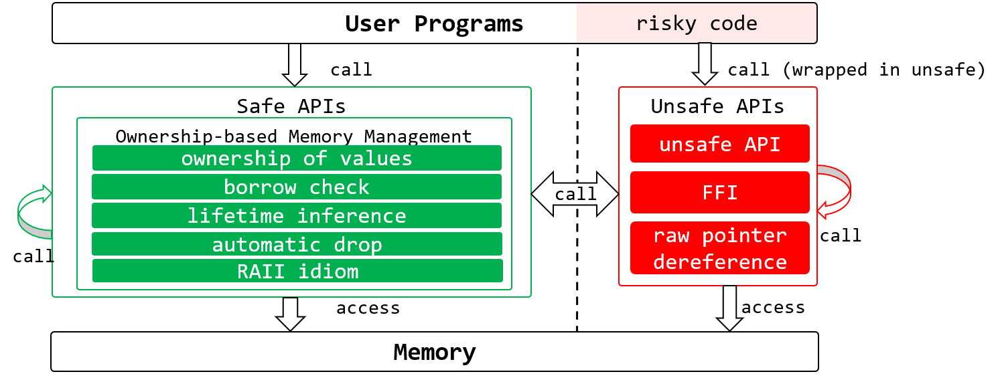
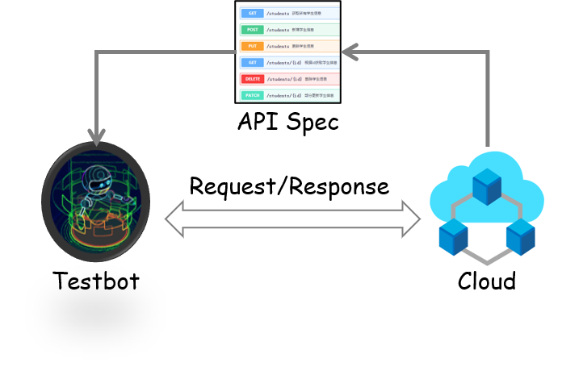

|[<b>Home</b>](https://hxuhack.github.io/) | [<b>Publications</b>](../publication/list) | [<b>AISR-Lab</b>](../lab/page) | [<b>Misc</b>](../misc/list) |

复旦大学智能软件可靠性实验室（AISR-Lab）专注程序分析、软件测试等软件可靠性技术研究，并致力于将研究成果应用于移动计算、云计算、人工智能等系统软件的可靠性提升。

### Project1: Memory-safety Bug Prevention Based on Rust

Some preliminary results can be found [here](https://arxiv.org/abs/2003.03296)

#### 项目成员：
- 姜剑锋
- 崔漠寒 
- 陈澄钧
- 卢修文

### Project2: Intelligent API Testing for Cloud Services

#### 项目成员
- 陈阳
- 林佳贤
- 李天宇
- 候梦圆
- 罗思成

### FYP Student 
 - 沈家诚 (2020）, 自动注释生成模型的可解释性研究

### Acknowledgement

We thank all the generous supporters for our research, including Huawei, CERNET, etc.
